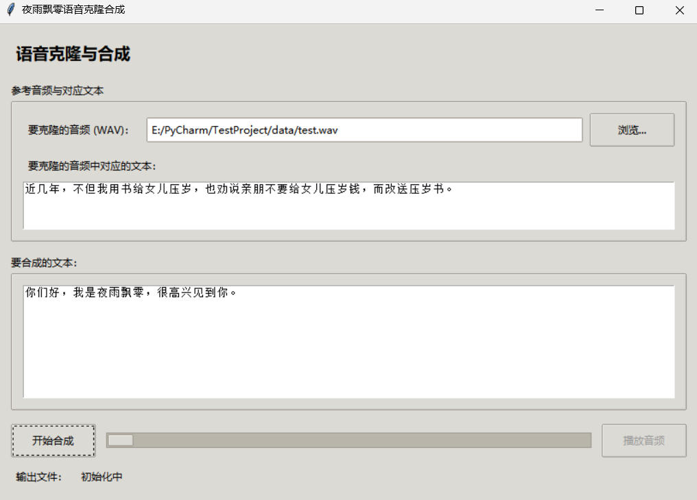
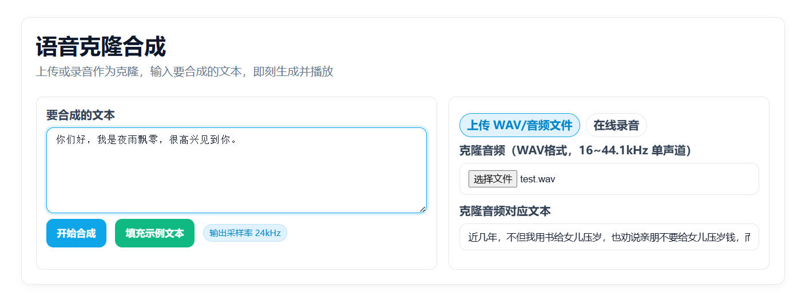

# 基于 NeuTTS Air 快速克隆语音合成

本项目是基于 NeuTTS Air 开发的快速语音克隆项目，用户可以根据自己的需求进行微调，也可以直接使用预训练模型进行语音克隆。只需要几秒钟的音频样本，即可快速克隆出自己的语音。

**欢迎大家扫码入知识星球或者QQ群讨论，知识星球里面提供项目的模型文件和博主其他相关项目的模型文件，也包括其他一些资源。**

<div align="center">
  
  
</div>


## 搭建环境

1. 首先要安装好 PyTorch 和 torchaudio。可以参考官方文档进行安装，安装命令如下。
```
# 安装GPU版本
pip3 install torch torchvision --index-url https://download.pytorch.org/whl/cu126
# 安装CPU版本
pip3 install torch torchvision
```

2. 安装espeak，Windows、Linux和MacOS安装的方式不一样，请根据自己的操作系统进行安装。

Linux执行下面三条命令安装espeak。
```
sudo apt install espeak
sudo apt upgrade espeak
sudo apt install espeak-ng-espeak
```

MacOS安装也比较简单，直接一条命令解决，但还需要做一些配置。
```
brew install espeak
```

MacOS可能需要将以下几行放在`neutts.py` 文件的顶部。
```python
from phonemizer.backend.espeak.wrapper import EspeakWrapper
_ESPEAK_LIBRARY = '/opt/homebrew/Cellar/espeak/1.48.04_1/lib/libespeak.1.1.48.dylib'
EspeakWrapper.set_library(_ESPEAK_LIBRARY)
```

Windows稍微麻烦一点，但也不是特别复杂，`data/espeak-ng.msi` 是一个安装文件，直接双击运行即可，按照默认选项安装即可，安装完成后，在Powershell中执行以下命令添加到环境变量中。
```
$env:PHONEMIZER_ESPEAK_LIBRARY = "c:\Program Files\eSpeak NG\libespeak-ng.dll"
$env:PHONEMIZER_ESPEAK_PATH = "c:\Program Files\eSpeak NG"
setx PHONEMIZER_ESPEAK_LIBRARY "c:\Program Files\eSpeak NG\libespeak-ng.dll"
setx PHONEMIZER_ESPEAK_PATH "c:\Program Files\eSpeak NG"
```

3. 安装剩余的依赖库。
```
pip3 install -r requirements.txt
```

## 开始克隆语音

本项目提供了一个`infer.py` 文件，可用于快速合成音频文件，其中`ref_audio_path`是克隆的音频文件路径，`ref_text`是克隆的音频文件对应文本，`input_text` 是要合成的文本，本项目克隆不需要额外的训练和微调，直接指定要克隆的音频文件路径和文本即可，如果没有GPU或者GPU显存不够可以在`infer.py` 文件中指定`backbone_device="cpu"`和`codec_device="cpu"`，使用CPU推理。本项目提供多种语言合成，可以指定不同的模型，实现不同的语言语音合成，指定不同语言时要指定`language`参数。
```python
from utils.neutts import NeuTTSAir
import soundfile as sf

tts = NeuTTSAir(
    backbone_repo="./models/neutts-air-zh",
    backbone_device="cpu",
    codec_repo="./models/neucodec",
    codec_device="cpu",
    language="cmn"
)
input_text = "你们好，我是夜雨飘零，很高兴见到你。"

ref_text = "近几年，不但我用书给女儿压岁，也劝说亲朋不要给女儿压岁钱，而改送压岁书。"
ref_audio_path = "data/test.wav"

ref_codes = tts.encode_reference(ref_audio_path)
wav = tts.infer(input_text, ref_codes, ref_text)

sf.write("output.wav", wav, 24000)

```

**克隆音频的要求：**

 - 单声道
 - 16-44 kHz 采样率
 - 时长 3-15 秒
 - 另存为.wav文件
 - 干净，最小甚至没有背景噪音
 - 自然、连续的语音 - 如独白或对话，几乎没有停顿，因此模型可以有效地捕捉语气


### GUI界面应用

本项目还提供了一个简单的GUI界面应用，用户可以在界面中输入要克隆的音频文件路径和文本，以及要合成的文本，点击合成按钮即可生成克隆音频文件，执行`python infer_gui.py`即可启动这个GUI应用。




### 服务接口

本项目还提供了一个服务接口，用户可以通过HTTP请求来调用模型进行语音克隆合成，执行`python infer_server.py`即可启动这个服务接口。

同时还提供了一个页面调试，页面如下，用户可以在页面中输入要克隆的音频文件路径和文本，以及要合成的文本，点击合成按钮即可生成克隆音频文件。




# 微调模型

微调模型的代码在`finetune`目录下，用户可以根据自己的数据集进行微调，其中`finetune.py`是微调模型的主文件，`finetune.yaml`是微调模型的配置文件，用户可以根据自己的需求修改这个配置文件，比如修改数据集路径、批量大小、学习率、训练步数数等。

首先要准备好自己的数据集，需要提前下载data_thchs30数据集，并将其解压到dataset目录下，准备好数据集后，然后执行`python create_data.py`生成微调模型所需的数据格式，主要是生成`dataset/train_data.jsonl`文件，这个文件就是训练数据，原来的音频文件就可以不用了，格式为每个样本占一行，每个样本是一个JSON字符串，包含`audio_path`、`duration`、`text`和`codes`四个字段，`audio_path`是音频文件路径，`duration`是音频时长，`text`是音频对应的文本，`codes`是音频对应的编码序列。

```
{"audio_path": "dataset/data_thchs30/data/D32_970.wav", "duration": 11.562, "text": "太平年月，千金之赠，不算慷慨困难时候，一饭之邀就令人感到温暖如春了。", "codes": [34902, 39137, ...]}
{"audio_path": "dataset/data_thchs30/data/D32_971.wav", "duration": 11.562, "text": "最后，森怪送狗弟小嘟，她则开车把鸡头桑尼载回桑尼位，在南港车站附近的偏僻宿舍。", "codes": [35238, 22738, ...]}
```

生成训练数据后，然后执行`python finetune.py`即可开始微调模型，微调完成后，模型会保存在`output/`目录下，请忽略里面的`checkpoint-*`目录，同时把`output/`目录下的模型文件复制到`models/neutts-air-zh`目录下即可。
